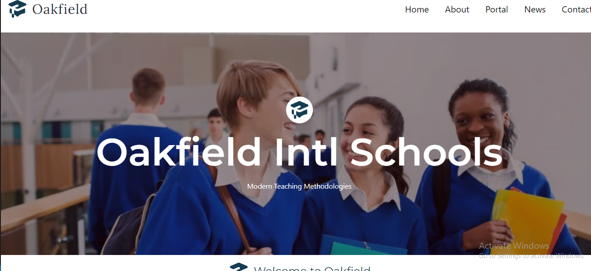

# Oakfield International Schools - School Website and Admin Dashboard

## Table of Contents

- [Introduction](#introduction)
- [Features](#features)
- [Technologies Used](#technologies-used)

## Introduction

**Oakfield International Schools** is a school website and admin dashboard project built with React and TypeScript. It serves as an online platform for the school community, providing information, resources, and administrative tools.

## Features

- **School Website**: A public-facing website offering school information, news, events, and resources.
- **Admin Dashboard**: An administrative interface for school staff to manage content, users, and data.
- **Backend API**: Powered by Node.js and Express, the backend API handles data storage, authentication, and serves as the core of the application.
- **Cloud Provider**: AWS (Amazon Web Services) is used as the cloud provider to host the backend API, ensuring scalability and reliability.
- **Live Call Functionality**: Implementing WebRTC and Socket.io, the project features live call capabilities, enabling real-time communication within the school community.

## Technologies Used

- **Frontend**: React, TypeScript
- **Backend**: Node.js, Express.js
- **Cloud Provider**: AWS (Amazon Web Services)
- **Real-time Communication**: WebRTC, Socket.io
